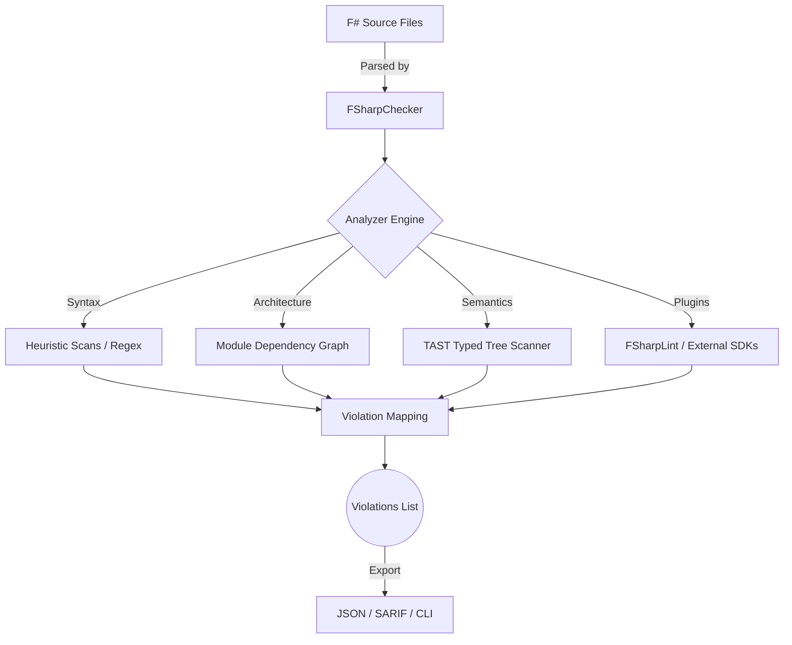
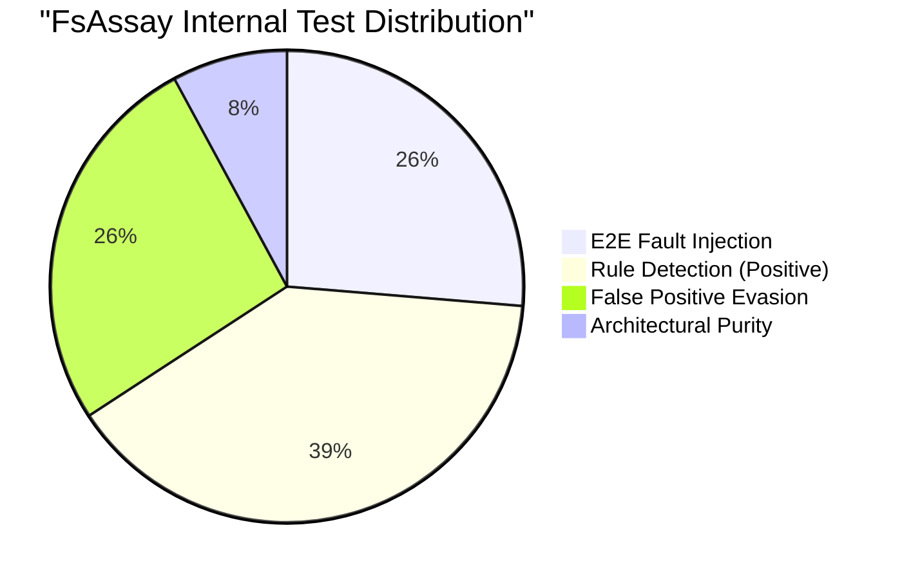

<div align="center">
  
  <h1>FsAssay</h1>
  <p><strong>The Elite F# Architecture & Code Quality Engine</strong></p>
  
  [](#)
  [](#)
  [](#)
  [](#)
</div>

<br/>

> [!IMPORTANT]
> **FsAssay** is not just another linter. It is a strictly opinionated **Type Gym** and Code Quality Engine designed to enforce elite-tier functional F# standards through deep heuristic and TAST (Typed Abstract Syntax Tree) analysis.

---

## ⚡ The Vision: Beyond Linters

Most tools like `FSharpLint` are excellent for formatting and surface-level syntax rules. FsAssay operates at the architectural level. By migrating away from purely syntactic heuristics to **F# Compiler Service Typed Trees**, FsAssay understands the *intent*, *data flow*, and *architectural boundaries* of your codebase.

**FsAssay guarantees:**
- **Zero Mutable State**: Identifies and eradicates unidiomatic `<-` allocations and mutable collections.
- **Architectural Purity**: Enforces Domain-Driven Design (DDD). E.g., `System.IO` in a Domain module triggers a P0 violation.
- **Security by Default**: Proactively scans for SSRF and Prompt Injection patterns (LLMs).
- **Test-Driven Design**: Identifies domain modules missing corresponding automated tests.

---

## 🏗️ How It Works: The Analysis Pipeline

FsAssay fuses **Regex Heuristics**, **AST Parsing**, and **Dependency Graphing** into a unified evaluation pipeline.



### The Module Graph Builder
FsAssay maps out your solution structure dynamically:
- Maps all internal module dependencies.
- Prevents layer inversions (e.g., Domain calling Infrastructure).
- Detects cyclical references early.

---

## 🚀 Key Capabilities

### 1. The Core Analyzer
Enforces rules strictly tailored to elite functional programming:
* **FSA-C10**: No `Unchecked.defaultof<_>`.
* **FSA-F04**: Strict avoidance of implicit unit sequences (e.g., `if...then` without `else ()`).
* **FSA2022**: Absolute ban on impure I/O Operations (`System.IO`, `HttpClient`) in Domain modules.

### 2. External Plugin Support (Phase 8 Completed)
FsAssay integrates natively with the **F# Analyzer SDK**. 
Load custom compiled analyzers dynamically via Reflection:
```bash
dotnet run --project FsAssay.Runner -- --plugin ./path/to/MyCustomAnalyzer.dll .
```
This automatically merges native `FSharpLint` rules alongside elite FsAssay rules in a single unified SARIF/JSON report.

### 3. Model Context Protocol (MCP) Server
FsAssay acts as a persistent Language Server bridging directly into AI Agents (Claude / GPT).
* Automatically stream violations as JSON-RPC payloads.
* Request AI-driven fixes for architectural problems directly via IDE integrations.

---

## 💻 Getting Started

### Installation
Clone the repository and build the runner:
```bash
git clone https://github.com/CanonFlowFoundation/FSharpAssay.git
cd FSharpAssay
dotnet build
```

### Running the Engine
Point the engine at any F# project or directory:
```bash
# Scan a project
dotnet run --project FsAssay.Runner/FsAssay.Runner.fsproj -- ./MyAwesomeApp

# Run with Adjudicate Mode (evaluate precision/recall against expected failures)
dotnet run --project FsAssay.Runner/FsAssay.Runner.fsproj -- -a ./MyAwesomeApp
```

> [!TIP]
> Use `--profile core` or `--profile script` to tailor the engine's strictness based on the target context.

---

## 📈 Quality Assurance: Self-Hosting
FsAssay believes in "**eating our own dog food**". 
The engine continuously runs against its own source code to demonstrate its viability. Any architectural regressions within the FsAssay codebase block the CI pipeline immediately.



---

<div align="center">
  <i>Built with ❤️ by the CanonFlow Foundation. Enforcing Functional Excellence.</i>
</div>
