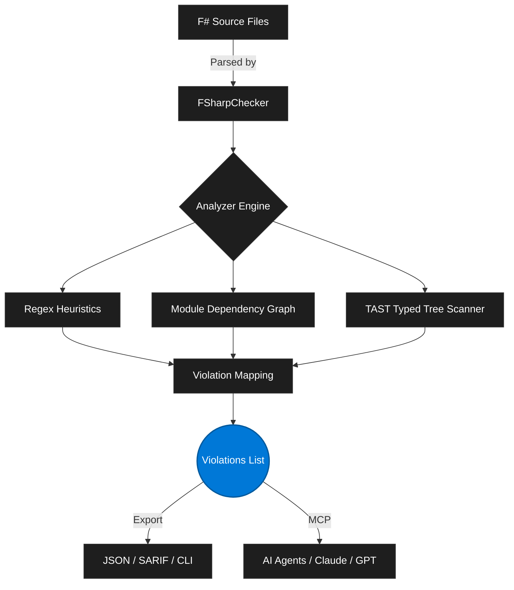

<div align="center">
  
  <h1>FsAssay</h1>
  <p><strong>The Elite F# Architecture & Code Quality Engine</strong></p>

  [](#)
  [](#)
  [](#)
  [](#)
</div>

<br/>

> [!IMPORTANT]
> **FsAssay is not a formatter.** It is a highly opinionated **Type Gym** and code quality engine designed to enforce elite-tier functional F# standards. Utilizing Deep Typed Abstract Syntax Tree (TAST) analysis, FsAssay understands the intent, data flow, and architectural boundaries of your entire solution.

---

## ⚡ The Vision: Beyond Linters

While conventional tools focus on syntax and formatting, FsAssay operates at the **architectural level**. 

**Core Guarantees:**
- 🛡️ **Zero Mutable State**: Identifies and eradicates unidiomatic `<-` allocations and mutable collections, enforcing pure functional state-passing.
- 🏗️ **Architectural Purity**: Enforces Domain-Driven Design (DDD). Importing `System.IO` or `HttpClient` in a Domain module triggers a P0 architectural violation.
- 🤖 **AI Security by Default**: Proactively scans for SSRF, Prompt Injection patterns, and unsafe LLM boundaries.
- 🧪 **Self-Adjudicating TDD**: Evaluates its own rules recursively, proving stability through the built-in Adjudicator.

---

## 🏗️ The Analysis Pipeline

FsAssay leverages a unified evaluation pipeline combining heuristic scanning, TAST extraction, and deep dependency graphing.



---

## 🚀 Key Capabilities

### 1. The Core Analyzer
Strict rules tailored to functional programming mastery:
* **FSA-C10**: Bans `Unchecked.defaultof<_>`.
* **FSA-F04**: Strict avoidance of implicit unit sequences.
* **FSA2022**: Absolute ban on impure I/O Operations in Domain modules.

### 2. Model Context Protocol (MCP) Server
FsAssay acts as a persistent Language Server bridging directly into AI Agents (Claude / GPT).
* Automatically stream violations as JSON-RPC payloads.
* Request AI-driven fixes for architectural problems dynamically.

### 3. Precision Adjudicator
Built-in tooling to evaluate the Precision/Recall of rules against `// EXPECT` comments, guaranteeing 0 false positives during rule tuning.

```bash
dotnet run --project FsAssay.Runner -- --adjudicate --profile Default .
```

---

## 💻 Getting Started

### Installation

Clone the repository and build the engine:
```bash
git clone https://github.com/CanonFlowFoundation/FSharpAssay.git
cd FSharpAssay
dotnet build
```

### Running the Engine
Execute a deep scan on any F# project:
```bash
dotnet run --project FsAssay.Runner/FsAssay.Runner.fsproj -- ./MyAwesomeApp
```

### Interactive Watch Mode
Run in watch mode to continually audit your code as you write:
```bash
dotnet run --project FsAssay.Runner/FsAssay.Runner.fsproj -- -w ./MyAwesomeApp
```

---
<div align="center">
  <i>Built with ❤️ by the CanonFlow Foundation.</i>
</div>
